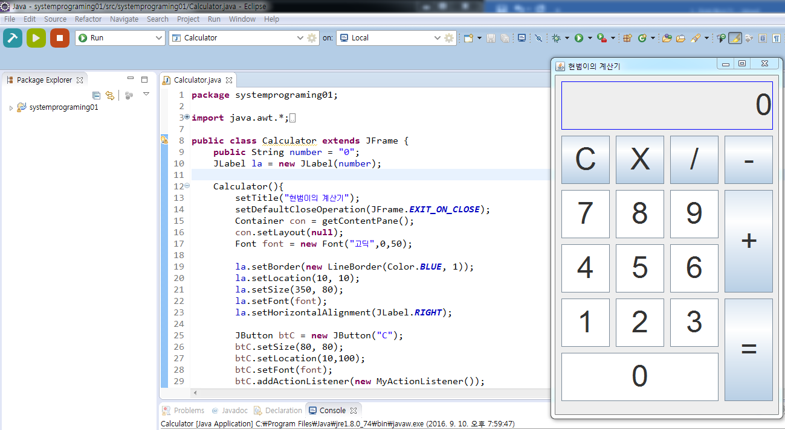
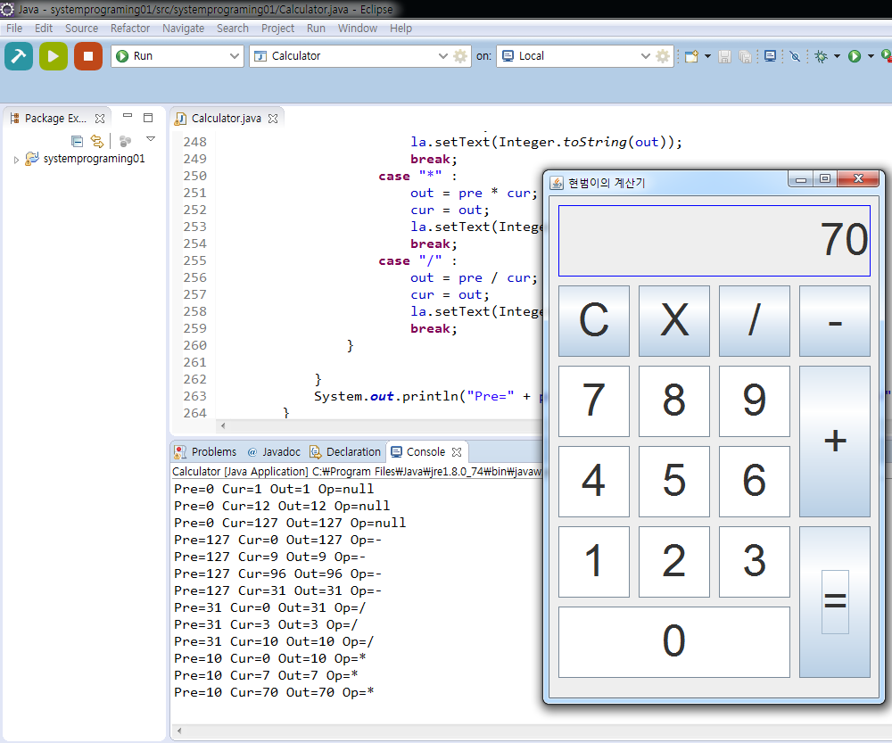
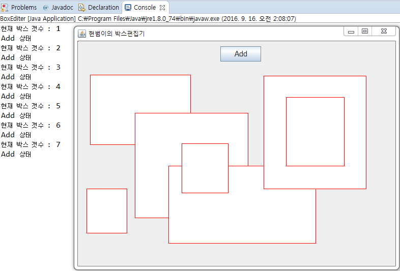
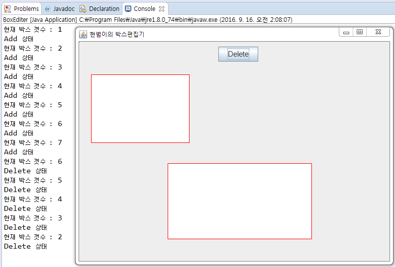
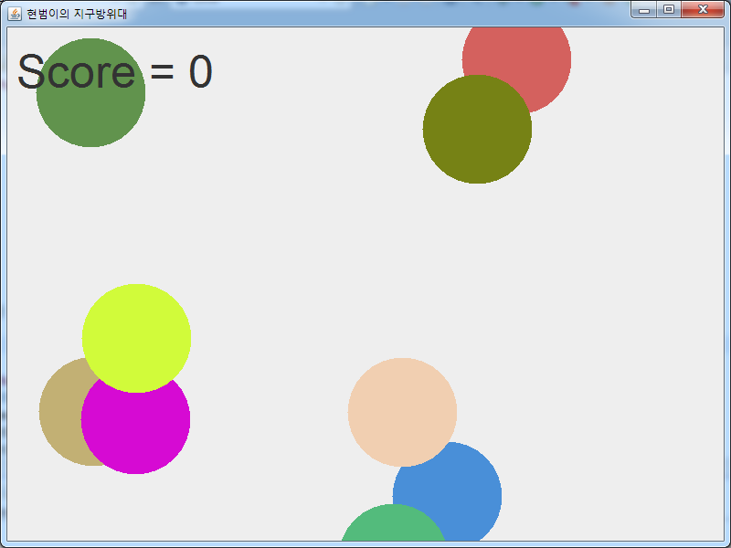
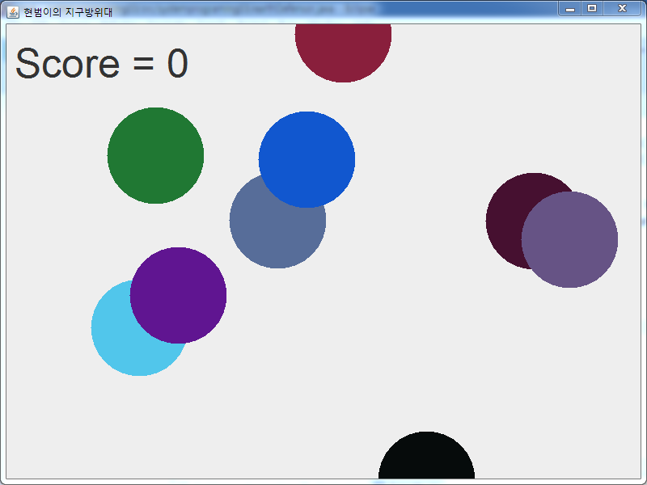
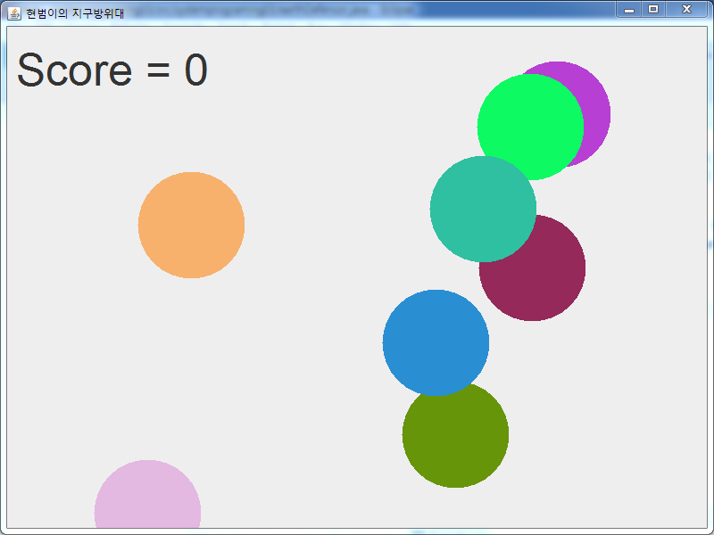

# systemPrograming_java
1. Caculator
2. BoxEditor
3. EarthDefensor
4. SpaceWar
5. MoonPatrol
6. Simulation_elevator

**Caculator**

1. 문제 정의</br>
    Java GUI 와 Event 를 활용하여 계산기 프로그램을 개발합니다.</br>
    GUI를 사용하여 계산기의 기능을 하는 버튼을 제작하고, 디자인을 합니다. </br>
    그리고 일반적인 계산기 동작이 가능하도록 개발하고, 연속적으로 이전 결과값을 사용하여 계산할 수 있도록 개발합니다. </br>
    마지막으로 초기화 기능을 개발하는 것이 문제입니다.</br>

2. 해결 과정</br>
    우선 계산기 디자인을 하는데 레이아웃 매니저를 사용하려고 했습니다. </br>
    Flow 레이아웃을 사용해서 디자인을 하려고 했지만, JPanel을 중복해서 사용하는 법이 익숙하지 않고, 개념이 부족하다고 느꼈습니다.</br>
    따라서 레이아웃 매니저를 사용하지 않고, 직접 좌표와 크기를 정하여 계산기를 디자인 했습니다.</br>
    그 다음으로 디자인된 버튼에 이벤트를 적용했습니다. </br>
    내부 클래스로 이벤트 리스너를 만들었습니다. </br>
    어떤 버튼이 눌렸는지 if문을 사용하여 구별하고, 각 버튼에 따라서 이벤트 기능을 개발했습니다. </br>
    숫자 버튼과 연산 버튼 그리고 초기화 버튼이 선택될 때를 구별해서 알고리즘을 개발했습니다.</br>  
    사용한 변수는 총 5개입니다. </br>
    4개의 변수와 int형 ‘chipher’라는 변수를 생성했습니다. </br>
    이 변수는 한 자릿수 이상의 숫자를 저장할 때, 자릿수를 저장하고 있다가 계산에 사용되는 변수입니다.</br>
    초기화 값은 10이고, 만약 버튼 ‘1’이 눌렸다면 cur = cur * chipher + 1; 이 식을 사용하여 현재 입력 되는 숫자 값을 계산했습니다. </br>
    마지막으로 ‘=’ 버튼이 눌렸을 경우 switch문에서 op (선택 된 연산자) 변수로 case를 구분했습니다.</br></br>




**BoxEditor**

1. 문제 정의</br>
    1.1 문제 정의</br>
    마우스로 사각형을 그립니다.</br> 여러 방향으로 마우스를 움직여도 사각형이 올바르게
    그려지도록 합니다. </br>추가적으로 버튼을 하나 생성합니다.</br> 버튼을 사용하여 두 가지 상
    태를 개발합니다.</br> Add(사각형을 추가)상태 와 Delete(사각형을 삭제)상태를 개발합니
    다.</br> Add상태에서는 사각형을 100개까지 그릴 수 있게 개발하고, Delete상태에서는 그
    려진 사각형 중 클릭 된 사각형을 삭제할 수 있도록 개발합니다.</br> 추가적으로 사각형
    의 색깔은 빨간색 테두리에 내부는 흰색으로 그립니다.</br></br>
    
    1.2 개발해야 하는 부분</br>
    ○ 버튼을 생성하고 클릭할 때 마다 Add, Delete 상태로 변하게 합니다.</br>
    ○ Add상태에서 그려진 사각형이 지워지지 않고 계속 그려지게 합니다.</br>
    ○ Delete상태에서 사각형들을 개별적으로 선택되게 합니다.</br>
    ○ Delete상태에서 선택된 사각형이 삭제되게 합니다.</br>
    ○ 사각형의 색깔을 정해진 디자인에 맞게 수정합니다.</br></br>
  
2. 해결 과정</br>
    버튼 생성을 위해서 Container를 생성하고, JButton을 생성했습니다.</br> 크기와 위치 그리고
    폰트를 설정했습니다.</br> 그리고 익명클래스를 사용하여 버튼에 ActionListener를 생성했습니
    다.</br> Boolean형 변수 click이라는 이름의 변수를 생성하여, 현재 Add상태인지 Delete상태인
    지 구분을 했습니다.</br>
    Add상태에서 그려진 사각형이 다음 사각형을 그릴 때 지워지는 문제가 발생했습니다.</br> 이
    점을 해결하기 위해서 그려진 사각형들의 좌표 값을 저장하는 변수를 배열로 생성하여
    사각형의 x, y와 w, h를 저장합니다.</br> 그리고 새로운 사각형을 그려질 때 마다 이전 사각형
    들의 값들을 불러와 계속 그려주도록 알고리즘을 개발했습니다.</br>
    Delete상태에서는 마우스의 클릭과 드래그 함수의 내용을 수정해야했습니다.</br> 따라서
    mousePressed( )에서 click이란 Boolean변수로 Add상태와 Delete상태를 if문으로 구분했
    습니다.</br> 마우스로 클릭한 좌표 값을 받아와서 이미 배열에 저장한 사각형들의 좌표와 비
    교하여 어떤 사각형의 내부인지 찾았습니다.</br> for문안에 if문을 사용하여 좌표를 비교합니
    다.</br> e.getX( )와 e.getY( )는 마우스 클릭 좌표이고, 배열 x, y, w, h는 사각형의 정보입니다.</br></br>
    if(x[i] < e.getX() && (x[i] + w[i]) > e.getX() && y[i] < e.getY() && (y[i] + h[i]) > e.getY())</br></br>
    이 if문이 true가 되면 해당 사각형 좌표들을 0으로 초기화 합니다.</br> 여기서 사각형이 삭제
    될 때 겹쳐지는 사각형의 우선순위에 문제가 있었습니다.</br> 이 문제를 해결하기 위해서 좌
    표 비교 순서를 마지막에 만들어진 사각형부터 비교하여 삭제하고, 삭제되면 for문을
    break하는 방법으로 해결했습니다.</br>
    사각형의 색깔을 바꾸는데 있어 테두리와 내부를 따로 해야하는 문제가 있었습니다.</br> 이
    문제를 해결하기 위해서 g.fillRect( )를 사용하기전에 setColor( )로 하얀색을 지정하고 다
    시 setColor( )를 빨강색으로 바꾼 뒤 g.drawRect( )로 사각형을 그리는 순서로 문제를 해
    결했습니다.</br></br>




**EarthDefensor**

1. 문제 정의</br>
    1.1 문제 정의</br>
    10개 이상의 색상을 가진 여러 폭탄을 타이머에 따라서 움직이고, 마우스로 폭탄을
    클릭하면 화면에서 제거되고, Score가 하나 증가합니다.</br> 그리고 Score가 10점이 되면
    프로그램을 종료합니다.</br> 떨어지는 폭탄은 객체 배열로 선언합니다.</br> 타이머 이벤트를
    사용하여 폭탄을 움직입니다. </br>마우스 클릭과 폭탄의 중심 좌표를 계산하여 제거의 유
    무를 정합니다.</br>
    
    1.2 개발해야 하는 부분</br>
    ○ 원모양의 폭탄을 그리고, 색상을 10개 이상으로 생성합니다.</br>
    ○ 원과 마우스 클릭의 좌표를 계산하여, 원의 제거 유무를 정합니다.</br>
    ○ 원을 객체로 생성하고, 그 객체를 배열로 선언합니다.</br>
    ○ 타이머 이벤트를 사용하여 원을 움직입니다.</br>
    ○ 마우스 이벤트를 사용하여 클릭을 감지합니다.</br>
    ○ 원의 제거를 카운트하고, 10개가 되면 프로그램을 종료합니다.</br>
    
2. 해결 과정</br>
    우선 폭탄 객체를 생성하기 위해서, Bomb라는 클래스를 만들었습니다.</br> 이 클래스에는
    폭탄의 x, y(좌표), r(반지름), s(속도), c(색상) 정보가 있습니다.</br> 그리고 각각 값들은
    Math.random( )을 사용하여 초기화 했습니다. </br>처음에는 생성자를 통해 초기화를 했습니
    다. </br>하지만 나중에 폭탄이 제거되고 새로 생성될 때, 다시 초기화를 하는 과정이 있어서,
    newBomb( )라는 함수를 생성하고, 초기화를 함수를 통해 했습니다.</br>
    폭탄의 색상을 만들기 위해서 처음에는 Switch문을 사용하여 Color함수에서 제공해주는
    10가지 색상을 사용했습니다.</br> 하지만, 색상을 좀더 다양하게 하고 싶어서, Color함수에 직
    접 R,G,B,A의 값을 넣었습니다.</br> 각 값들은 0~255까지의 정보를 가지고 있었습니다.</br> 따라
    서 각 값들에 0~255까지 Math.random( ) 함수를 사용하여, 10개이상의 색상을 구현했습
    니다. </br>투명도인 A(Alpha)값은 255로 고정했습니다.</br></br>
    c = new Color((int) (Math.random() * 255), (int) (Math.random() * 255), (int) (Math.random() * 255), 255);</br></br>
    폭탄 객체를 생성한 뒤에 바로 타이머를 시작합니다.</br> TimerHandler 클래스에서는 각각
    폭탄 객체들의 y좌표에 s(속도)를 더해줍니다.</br> 속도는 랜덤이기 때문에 각각 폭탄들 마다
    움직이는 속도가 다르게 됩니다.</br> 그리고 폭탄의 위치가 화면 밖으로 (제거가 되지 않은
    상태로) 이동할 경우 newBomb( )함수를 실행해서, 폭탄 객체의 정보를 초기화 합니다.</br> 따
    라서 폭탄은 화면 밖으로 이동하면 다시 화면 위에서 새로 생성되게 됩니다.</br>
    MyMouseListener 클래스에서는 폭탄의 중심 좌표와 반지름의 값과 마우스 클릭의 좌
    표 값을 비교하여 폭탄의 제거 유무를 정합니다.</br> 먼저 생성되는 객체가 화면상 뒤쪽에 그
    려지기 때문에 반복문 for에서 i의 값을 감소시킵니다. </br>그리고 원의 좌표의 x, y값이 원의
    중심이 아닌 왼쪽 상단에 위치합니다.</br> 따라서 폭탄의 좌표에 각각 반지름을 더해준 값이
    폭탄의 중심이고, 좌표에 반지름을 더합니다.</br></br>
    if(Math.sqrt(Math.pow((e.getX() - (ball[i].x + ball[i].r)), 2) + Math.pow((e.getY() - (ball[i].y + ball[i].r)),2)) < ball[i].r)</br></br>
    위의 if문이 참일 경우 폭탄이 클릭 된 상태이고, newBomb( )함수를 사용하여 폭탄의 값
    을 초기화 합니다.</br> 여기서 Score값을 하나 증가 시킵니다.</br> 그리고 만약 Score가 10개가
    되면 타이머를 멈추고, 프로그램을 종료합니다. </br></br>






**SpaceWar**
```

```
**MoonPatrol**
```

```
**Simulation_elevator**
```

```

